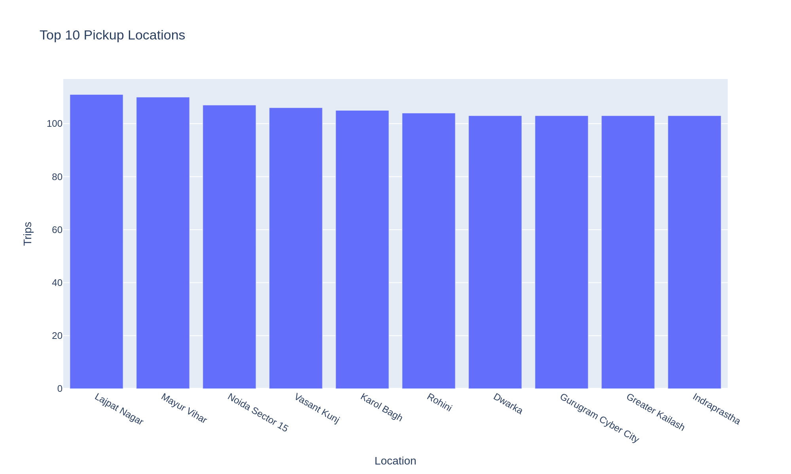
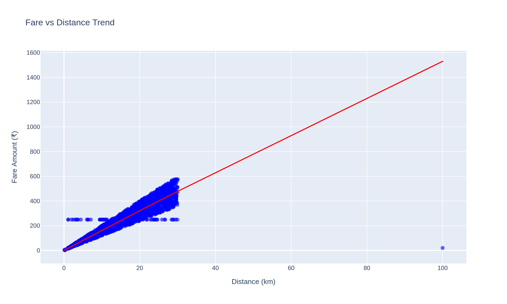
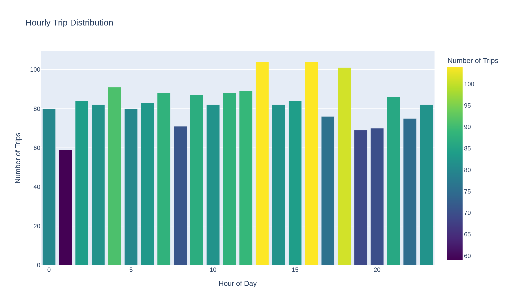
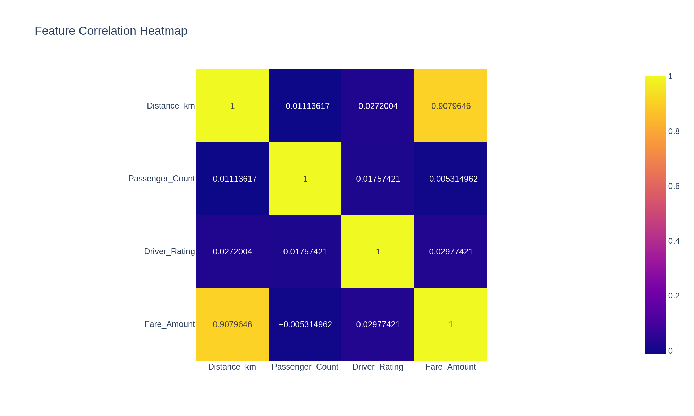

# Uber Fare Prediction — Delhi NCR

Predicting Uber fares in Delhi NCR using a Random Forest regression model, built on 2,000+ trip records with full data cleaning, feature engineering, EDA, and a companion Power BI dashboard for business-side reporting.

---

## Project Overview

Ride-hailing platforms lose money two ways: quote a fare too low and the margin's gone, quote it too high and the rider books a competitor. This project takes a raw, messy trip dataset — missing ratings, misspelled payment types, a few impossible trip distances — and turns it into a working fare prediction pipeline: clean the data, engineer time and pricing features, train a Random Forest model, and validate what actually drives the fare versus what was assumed to.

A Power BI dashboard sits on top of the same cleaned data for stakeholders who want the numbers without opening a notebook.

**Problem statement**: given a trip's distance, time, day, and passenger count, predict the fare accurately enough to support pricing decisions — and identify which factors actually move the price, so pricing strategy isn't built on assumptions that don't hold up in the data.

## Key Insights

1. **Distance is the fare.** It explains 91% of fare variance (Pearson r = 0.908) and drives 94.3% of the trained model's predictions. Every other variable combined — time of day, day of week, passenger count — accounts for the remaining 6%. If a pricing team wants one lever to get 90% of the way to an accurate quote, it's distance.

2. **The engineered surge-pricing features had no measurable effect on actual fares.** Peak-hour multipliers, weekend premiums, and time-of-day pricing were built into the feature set to mirror how real surge pricing works — but average fare barely moved between peak (₹253.26) and off-peak (₹253.31), or weekday (₹252.83) and weekend (₹254.50). Differences of a few rupees, not a pricing pattern. The model reflects this: `Final_Multiplier` and `Time_Multiplier` combined contribute under 1.2% feature importance. Either this dataset's fares aren't generated with real surge logic, or that logic isn't captured here — either way, this should be verified before anyone builds a live pricing rule on top of it.

3. **Trip volume and revenue don't move together.** Off-peak hours generate ~75% of total revenue (₹3.81L vs ₹1.25L) purely because there are more off-peak hours and more trips within them, not because those trips cost more. Night is the single busiest time-of-day bucket (639 of 1,997 trips) despite carrying no fare premium — a supply-planning signal, not a pricing one. Driver availability should track trip volume by hour; right now the fare structure isn't compensating for night-hour demand.

4. **Payment method is a near-even three-way split** — Card 33.9%, Wallet 33.6%, Cash 32.5%. No dominant channel to optimize checkout flow around.

5. **Model accuracy in practical terms**: a mean absolute error of ₹35.28 on fares averaging ~₹253 means the model is off by roughly 14% on a typical trip. Good enough for a first-pass estimate, not tight enough to replace a metered or GPS-based fare calculation in production.

## Data Cleaning & Preprocessing

**Raw dataset**: 2,030 trip records, 10 columns (trip ID, date, time, pickup/drop location, distance, payment type, passenger count, driver rating, fare amount).

**Issues identified:**
- 62 missing `Pickup_Location` values
- 61 missing `Driver_Rating` values
- 61 missing `Fare_Amount` values
- 27 duplicate rows
- Misspelled `Payment_Type` entries (`Cadr`, `Cahs`, `Walet`, `cahs`)
- Unrealistic outliers (trip distance >100 km, fare >₹5,000)

**Cleaning steps:**
- Missing `Pickup_Location` → filled as `Unknown` rather than dropped, to preserve trip volume for time-based analysis
- Missing `Driver_Rating` and `Fare_Amount` → filled with median (mean would have been skewed by outlier fares)
- Payment type typos standardized to `Cash` / `Card` / `Wallet`
- Distance and fare outliers beyond realistic city-ride bounds removed
- Duplicate records dropped

**Result**: 1,997 usable records after cleaning.

**Feature engineering** — 14 features built for modeling:
- **Time features**: hour, day of week, month, weekend flag, time-of-day category (Morning/Afternoon/Evening/Night), peak-hour flag (7–10 AM, 5–8 PM)
- **Pricing features**: time-based multiplier (e.g. 40% late-night premium, 30% morning peak premium), day-based premium (15% Friday, 25% weekend), combined into `Final_Multiplier`
- **Trip features**: fare per km, trip category by distance (Short/Medium/Long), pickup→drop route
- **Rating features**: rating category, binned rating
- Individual day-of-week flags, so the model could detect day-specific patterns rather than assuming a flat weekend/weekday split

## Model Performance

**Algorithm**: Random Forest Regressor (`n_estimators=150`, `max_depth=20`, `min_samples_split=5`, `random_state=42`)
**Split**: 80/20 train-test (1,597 train / 400 test)

| Metric | Value |
|---|---|
| R² Score | 0.884 |
| Mean Absolute Error | ₹35.28 |

**Feature importance:**

| Feature | Importance |
|---|---|
| Distance (km) | 94.3% |
| Hour of day | 1.8% |
| Passenger count | 0.9% |
| Final pricing multiplier | 0.9% |
| Time multiplier | 0.3% |
| Day-of-week flags (combined) | ~1.5% |

## Visualizations







## Power BI Dashboard

A companion dashboard (`Dashboard_1.pbix`) built on the cleaned dataset, covering KPI cards (total trips, total revenue, average fare, average rating), zone-level trip volume, and time-of-day breakdowns.

## Tech Stack

- **Python**: Pandas, NumPy, Scikit-learn (Random Forest), Matplotlib, Seaborn, Plotly
- **BI**: Power BI (Power Query, DAX, custom dark theme)
- **Environment**: Jupyter / Google Colab

## Project Structure

```
uber-fare-prediction/
│
├── README.md
├── UBER_FAIR_PRICE_PREDICTION.ipynb
├── data/
│   ├── uber_delhi_unclean_dataset.csv
│   └── uber_delhi_clean_dataset.csv
├── dashboard/
│   └── Dashboard_1.pbix
├── models/
│   ├── uber_fare_predictor.pkl
│   └── model_columns.pkl
└── images/
    ├── top_pickup_locations.png
    ├── fare_vs_distance.png
    ├── hourly_trip_distribution.png
    ├── correlation_heatmap.png
    └── powerbi_dashboard.png
```

## Installation

```bash
git clone https://github.com/<your-username>/uber-fare-prediction.git
cd uber-fare-prediction
pip install pandas numpy scikit-learn matplotlib seaborn plotly joblib kaleido
jupyter notebook UBER_FAIR_PRICE_PREDICTION.ipynb
```

## Future Improvements

- Bring in real surge/demand signals (live driver supply, weather, local events) since the current time-based multipliers aren't reflected in actual fares
- Test gradient boosting (XGBoost/LightGBM) against the Random Forest baseline — distance dominance suggests the ceiling on R² is close without new signal
- Add geospatial features (actual lat/long distance vs. straight-line, zone clustering) instead of relying on named pickup/drop locations alone

## Author

**Tushar Gupta**
[LinkedIn](https://linkedin.com/in/tusharanalyst) · [GitHub](https://github.com/Tusharg5600) · tusharg5600@gmail.com
